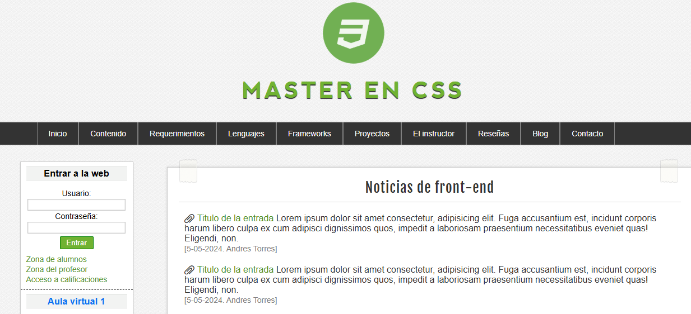

# Master en CSS – Noticias Front-End

# Tecnologias usadas
[](https://developer.mozilla.org/es/docs/Web/HTML)  
[](https://developer.mozilla.org/es/docs/Web/CSS)

## Vista previa



Puedes ver el proyecto funcionando en:  
https://iandrestm.github.io/noticias-frontend/

## Descripción del proyecto

Master en CSS – Noticias Front-End es una página estática creada exclusivamente con **HTML** y **CSS**, que presenta noticias sobre tecnologías front-end. Cuenta con una barra de navegación, formularios de acceso y una sección central con noticias y estilos claros y elegantes.

## Tecnologías usadas

- **HTML5** – Estructuración semántica del contenido.  
- **CSS3** – Estilos visuales, layout y detalles de diseño.  

## Características principales

- Diseño limpio y funcional.
- Secciones como “Noticias de front-end”, menú de navegación y formularios.
- Componente visual llamativo para mostrar artículos y entradas.

## Cómo ver el proyecto localmente

1. Clona este repositorio:  
   ```bash
   git clone https://github.com/iAndresTM/noticias-frontend.git
